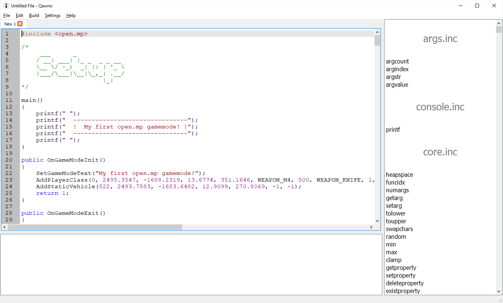
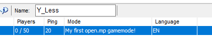
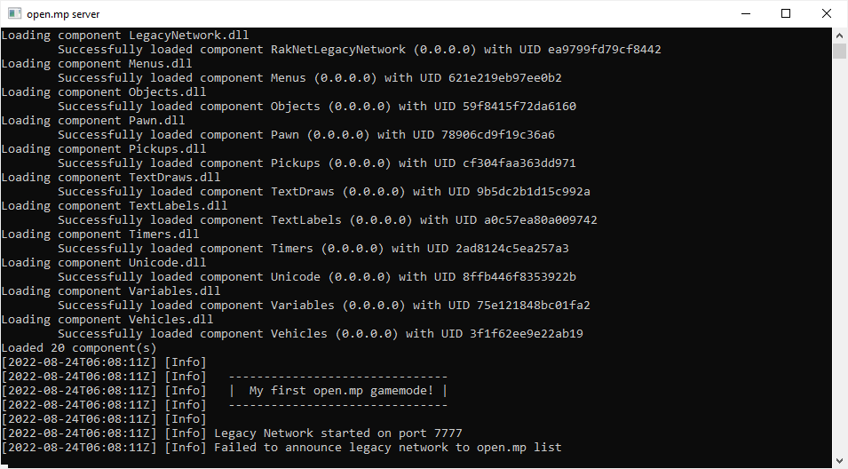
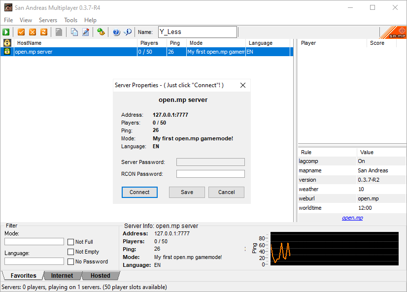

Welcome to open.mp and Pawn.  This guide assumes you are using the complete server package from [here](https://open.mp/download).  This includes Qawno, the editor we will use, all the default includes, and the server itself.  First, lets open up Qawno:

 The View
----------

Starting Qawno will give the following view:



The three main panes are:

* Top-Left - The main code view, where you write pawn.
* Bottom-Left - The compiler view, where you can see issues with your code.
* Right - The function list, with natives found in open.mp and third-party includes.

 The Code
----------

First we *include* another file, meaning we get access to all the code in there as well, allowing access to all the features of the server - things like vehicles, objects, map icons, and more.  The file is called `open.mp.inc`, but you don't need the extension.  There are many other *third-party* includes and components we can also download to provide more features.  Once your script starts growing beyond a few simple functions you will also want to start splitting the code in to multiple files to help with code management:

```pawn
#include <open.mp>
```

The green text after this include is called a *comment*.  It starts with `/*` and ends with `*/`.  The colour is to visually distinguish it from real code, because nothing in comments are compiled or run.  They are purely there to give information to humans reading the source code.  Comments can also start with `//`, that style finishing at the end of the line, not an explicit delimiter:

```pawn
/*
     ___      _
    / __| ___| |_ _  _ _ __
    \__ \/ -_)  _| || | '_ \
    |___/\___|\__|\_,_| .__/
                      |_|
*/
```

Now we get to our first custom code in a *function* - this one is called *main* and is special.  It is called when the mode first starts, but so is another function called `OnGameModeInit`, and most startup code tends to be found there instead.  So this function just prints a message, *printing* meaning it is displayed in the console window and not anywhere else.  The code between the *braces* (`{}`s, often incorrectly called *brackets*) are "inside" the function so when this function is called that is the code that is run:

```pawn
main()
{
	printf(" ");
	printf("  -------------------------------");
	printf("  |  My first open.mp gamemode! |");
	printf("  -------------------------------");
	printf(" ");
}
```

Then we get our first true *callback*.  A *callback* is a function in our code that the server calls at some time (in this case, when the mode starts).  Callbacks are always `public`, which allows the server to see them, and usually start with `On`, meaning "up*on* this event":
`
```pawn
public OnGameModeInit()
{
```

A *callback* is in contrast to a *native*, which is a function in the server that our code calls to do something.  `SetGameModeText`, the next line, is one such *native* and it defines the mode name seen in the server browser:

```pawn
	SetGameModeText("My first open.mp gamemode!");
```



Using a different native we tell the server to add a skin to the class selection screen before a player first spawns.  This sets the skin as `0` (CJ), the position (`2495.3547, -1688.2319, 13.6774`) somewhere in Los Santos, the angle (`351.1646`) facing south, and then gives the player three weapons with various levels of ammo  This is where the player will be after they select a skin and spawn, it is not where the skin appears while being selected.  Try duplicating this line (`Ctrl+D`) and changing the co-ordinates to see where you spawn, or open the client debug mode and type `/save` while on foot to generate more of these lines.  The co-ordinates are the second, third, and fourth *parameters*.  A parameter to a function configures that function, they are between the brackets (`()`s) that follow the function name, and they are separated by commas (`,`s).  Including the ones we examined and the weapons and ammo, `AddPlayerClass` has eleven parameters:

```pawn
	AddPlayerClass(0, 2495.3547, -1688.2319, 13.6774, 351.1646, WEAPON_M4, 500, WEAPON_KNIFE, 1, WEAPON_COLT45, 100);
```

Although running around is fun, this is *Grand Theft Auto* - we need some *autos*!  So create a vehicle that will spawn (and respawn after death) near to where the player will spawn:

```pawn
	AddStaticVehicle(522, 2493.7583, -1683.6482, 12.9099, 270.8069, -1, -1);
```

This native function takes seven parameters (again, separated by commas).  The first is the vehicle type (`522` is a motorbike); the second, third, and fourth are again the position (`X`, `Y`, and `Z`); the fourth is the angle again (the co-ordinates and angle are in the same position in both `AddPlayerClass` and `AddStaticVehicle` but that is just a co-incidence, not a rule).  The final two parameters are for the vehicle colours, but `-1` just means *random*.

Some of you may be used to numbers with a *decimal comma*, so *two and a half* is written `2,5`.  You should be aware that pawn always uses commas to separate parameters, and numeric fractions use a *decimal point* instead, thus *two and a half* is written as `2.5` instead.  Some of you may also be used to using commas (or dots) to separate thousands, so *one million* is written `1,000,000` or `10,00,000`.  Again, this does not work in pawn because commas separate parameters, but `_` can be used instead to write *one million* as `1_000_000` (or in *vedic* style as `10_00_000`).

Finally we signal the end of this function, and tell the server that our code was successful by passing it the value `1`:

```pawn
	return 1;
}
```

There are many more callbacks in the file, all invoked (run) by the server when different things happen.  For example, if you crash your car enough times eventually `OnVehicleDeath` will be called, and if you're still in the car then `OnPlayerDeath` will also probably be called.  `OnPlayerRequestClass` has some code in it already, which configures the server to show a nice shop mirror view while you are selecting your character.  Beyond that a comment saying `SPECIALIST` separates the common callbacks from more advanced ones.  You can write some very good modes with just the basic ones, so why not familiarise yourself with these first before moving on?

 Compiling
-----------

The server doesn't run the same code as you write, it needs to first be converted in to a format that's better for computers (but far far worse for people).  This process is called *compiling*.  Sometimes when you compile there will be mistakes in your code that mean it cannot be converted in to the computer format - these are *errors* and will mean the compilation fails entirely.  There can also be minor mistakes that won't stop the code compiling, but might mean the result is wrong anyway, these are pointed out to you as *warnings*.  It is important to know the difference as too few people understand this distinction:

* Errors - Code cannot run at all.
* Warnings - Code can run but might do the wrong thing.

To convert the code you need to run the *compiler*.  In Qawno this is done by pressing `F5` (check their documentation for other editors) and will give output something like:

```
pawncc -;+ -(+ -\ -Z- "-rD:/open.mpgamemodes/first" "-iD:/open.mpgamemodes/first" "-iinclude" -d0 -O2 -t4 "-oD:/open.mpgamemodes/first" "D:/open.mpgamemodes/first.pwn"


Pawn compiler 3.10.11	 	 	Copyright (c) 1997-2006, ITB CompuPhase
```

This is a successful compile.  The first line is the command used to run the compiler, the last line means things finished.  There are no warnings or errors so this code is good to go.

If you get warnings, the `.amx` file will still probably work, but there may be problems.  This output looks something like:

```
pawncc -;+ -(+ -\ -Z- "-rD:/open.mpgamemodes/first" "-iD:/open.mpgamemodes/first" "-iinclude" -d0 -O2 -t4 "-oD:/open.mpgamemodes/first" "D:/open.mpgamemodes/first.pwn"


D:\open.mp\gamemodes\first.pwn(25) : warning 203: symbol is never used: "a"
Pawn compiler 3.10.11	 	 	Copyright (c) 1997-2006, ITB CompuPhase


1 Warning.
```

If you get errors then the code did not compile.  You cannot use the result and you *must* fix those mistakes before you can continue:

```
pawncc -;+ -(+ -\ -Z- "-rD:/open.mpgamemodes/first" "-iD:/open.mpgamemodes/first" "-iinclude" -d0 -O2 -t4 "-oD:/open.mpgamemodes/first" "D:/open.mpgamemodes/first.pwn"


D:\open.mp\gamemodes\first.pwn(26) : error 001: expected token: ";", but found "return"
Pawn compiler 3.10.11	 	 	Copyright (c) 1997-2006, ITB CompuPhase


1 Error.
```

If you aren't sure how to solve an error or warning, pressing `Ctrl+E` (in Qawno) will copy the compiler output for you, so you can ask for help in the open.mp forums.  If you do know how to solve it, pressing `Crtl+E` again will jump to the first problem line (then the second, then the third, etc).

 Running
---------

Once your code has compiled you'll want to run it.  This is easy - just press `F6`.  An open.mp server will automatically start and run your mode with basic settings (there is documentation on customising these settings elsewhere):



You can then connect to the server at `127.0.0.1:7777` using the SA:MP server browser:



This is where the third type of mistake comes in; similar to warnings but the compiler can't spot them - *bugs*.  This is just code you've written that doesn't do what you want, but does something that is technically valid.  Dropping a player from 1000 units in the sky might not be what you wanted, but it is valid behaviour.  So there are no messages when you make these mistakes and you'll just have to work out why things aren't doing what you want.  Unfortunately computers are stupid, and they will do **exactly** what you tell them, regardless of how wrong it is and the fact that it isn't what you *meant*.  No warnings or errors doesn't mean your code is correct - welcome to debugging!

